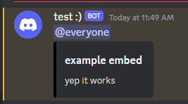

# info
this is a roblox library that generates a custom webhook message for roblox exploit scripts
# documentation
```lua
--// Initialization
local webhookBuilder = loadstring(game:HttpGet("https://raw.githubusercontent.com/plusbers/webhook-builder/main/webhookBuilder.lua"))()

--// Example
local webhook = webhookBuilder("WEBHOOK_HERE")
webhook:setContent("@everyone")
webhook:setUsername("test :)")

local embed = webhook:createEmbed()
embed:setTitle("example embed")
embed:setDescription("yep it works")
embed:setColor(0)

webhook:send()
```
<p align="center">
  
</p>
